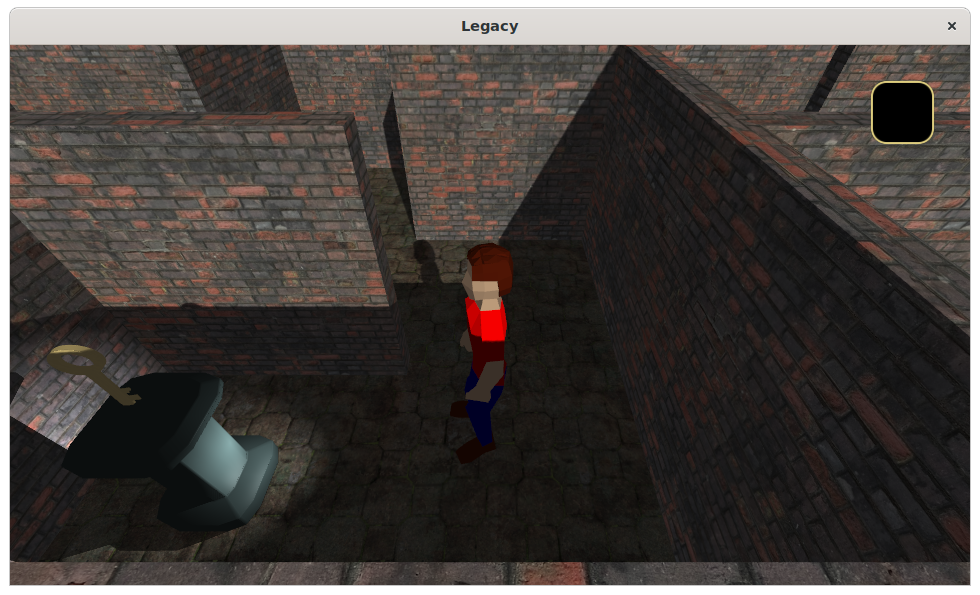
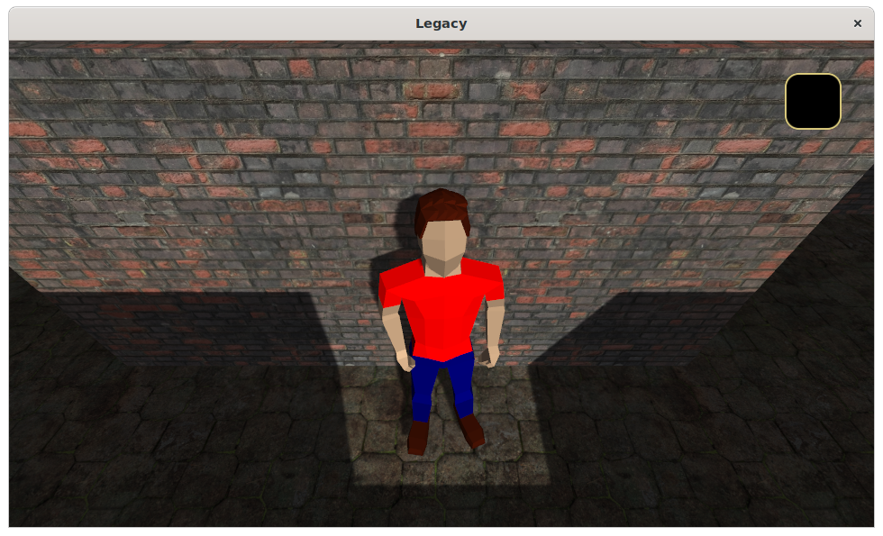
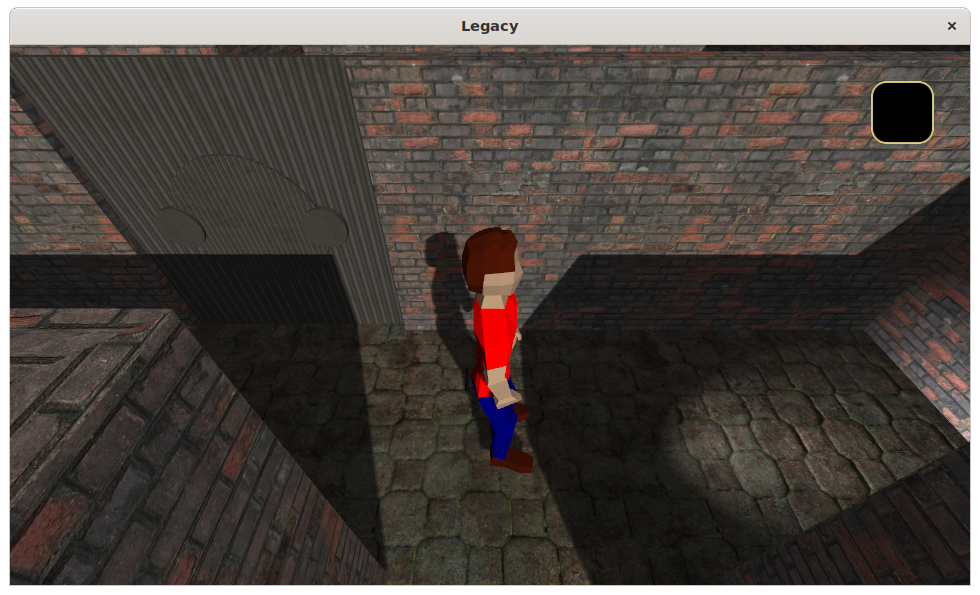
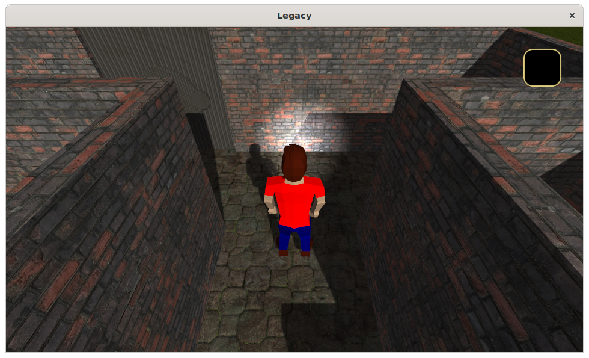
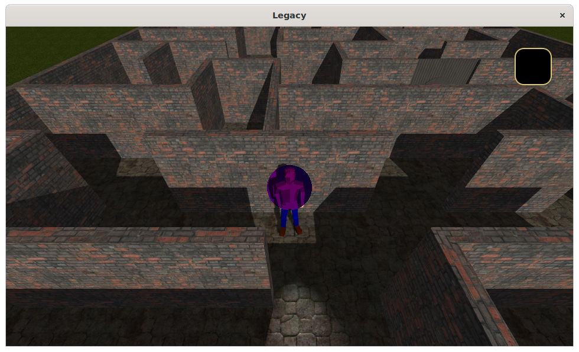
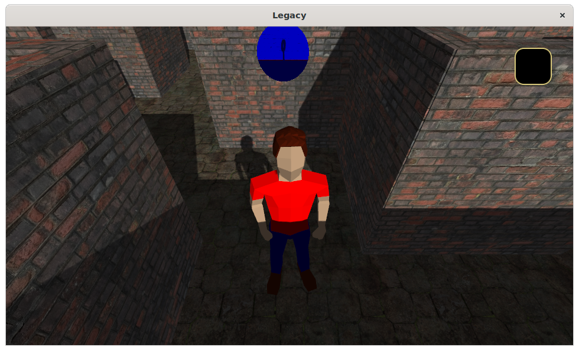

# Report

## Features

| Category | Name                      | Author(s)       |
| -------- | ------------------------- | ----------------|
| Graphics | Diffuse/Specular textures | Wessel          |
|          | Mipmapping                | Andor / Wessel  |
|          | Anisotropic filtering     | Wessel          |
|          | Normal mapping            | Arnoud          |
|          | Lighting                  | Wessel          |
|          | Normalized Blinn-Phong    | Wessel          |
|          | Directional light shadows | Wessel          |
|          | Spot light shadows        | Andor / Wessel  |
|          | Slope-based bias          | Wessel          |
|          | Depth-based bias          | Andor / Wessel  |
|          | PCF                       | Wessel          |
|          | Poisson sampling          | Wessel          |
|          | X-ray vision              | Andor           |
|          | Toon shading              | Andor / Wessel  |
|          | 2D icons                  | Wessel          |
| Modeling | Player character          | Andor           |
|          | House                     | Arnoud          |
|          | Wall                      | Arnoud          |
|          | Hierarchical door         | Arnoud          |
|          | Key                       | Wessel          |
|          | Pedestal                  | Wessel          |
| Logic    | AABB collision detection  | Andor           |
|          | Level design              | Arnoud          |
|          | Gates and keys            | Arnoud / Wessel |
| Other    | Framework                 | Wessel          |
|          | Model loader              | Wessel          |
|          | Gamepad support           | Wessel          |

## Screenshots

### Spot light shadows + Custom models

### Directional shadows

### Hierarchical door

### Normal maps

### X-toon shading

### X-ray vision

## References

- [Blinn–Phong reflection model](https://en.wikipedia.org/wiki/Blinn%E2%80%93Phong_reflection_model)
- [The Blinn-Phong Normalization Zoo](http://www.thetenthplanet.de/archives/255)
- [Normalization Article - Fabian Giesen](http://www.farbrausch.de/~fg/stuff/phong.pdf)
- [Shadow mapping tutorial](http://www.opengl-tutorial.org/intermediate-tutorials/tutorial-16-shadow-mapping/)
- [Adaptive Depth Bias for Shadow Maps](http://jcgt.org/published/0003/04/08/paper-lowres.pdf)
